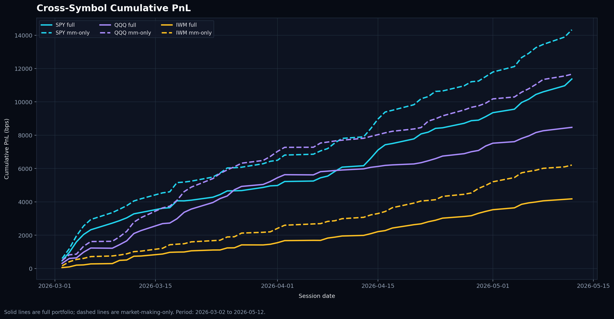
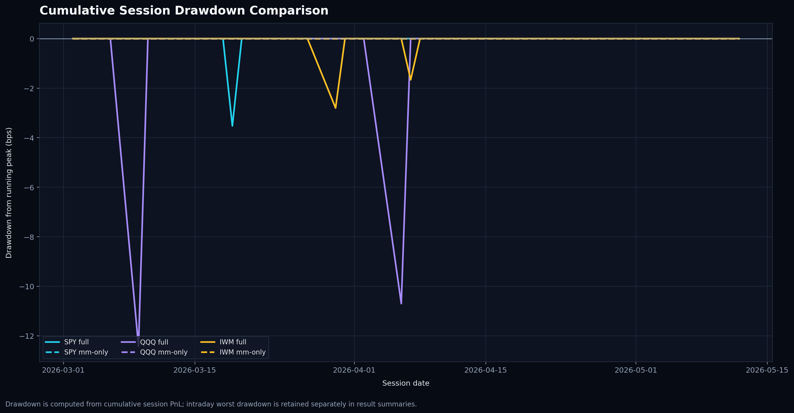
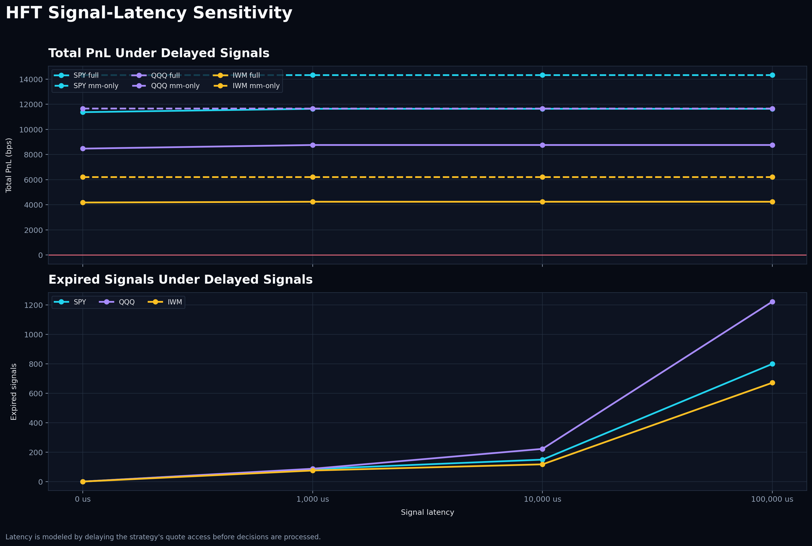
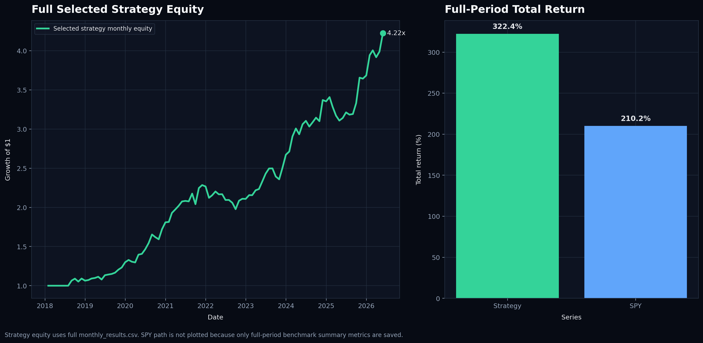
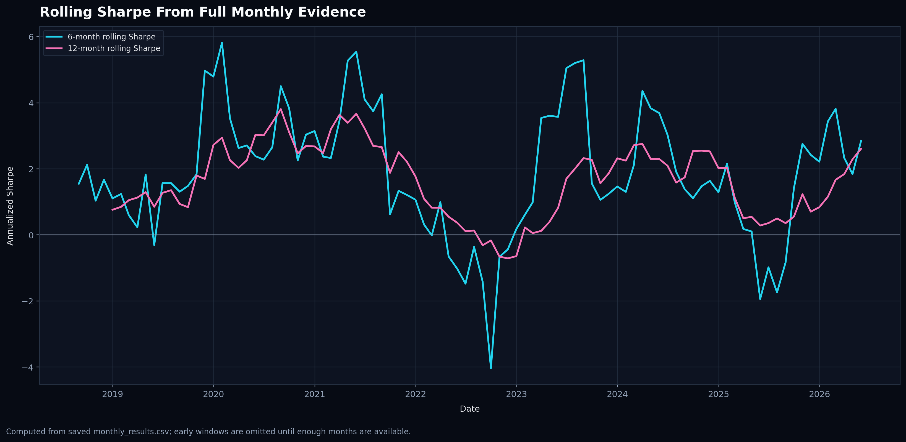
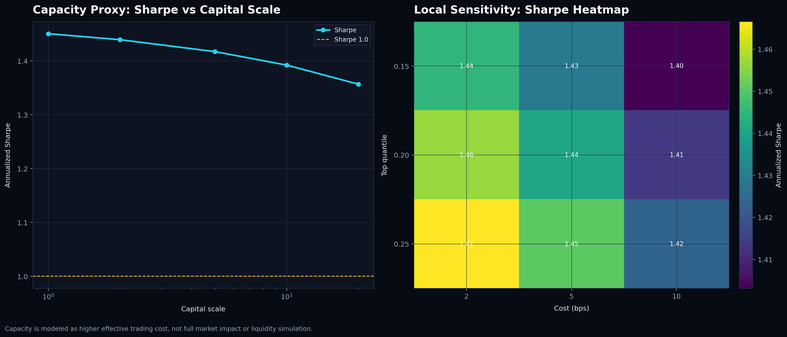

# Quant Trading Research Portfolio

A repository showcasing quantitative trading research across:

- High-frequency market microstructure strategies (C++)
- Execution-aware simulation and robustness testing
- Medium-term cross-sectional alpha research (Python)
- Regime-aware portfolio construction
- Risk and capacity analysis

This repository contains research-oriented trading systems and backtesting frameworks intended for educational and research purposes. It is not production trading software.

## Start Here

For reviewers:

- [REVIEWER_GUIDE.md](REVIEWER_GUIDE.md) - fastest overview of the project
- [PROJECT_SCORECARD.md](PROJECT_SCORECARD.md) - summary of evidence and current status
- [hft_microstructure/](hft_microstructure/) - HFT research and execution simulation
- [medium_term_alpha/](medium_term_alpha/) - medium-term alpha research framework
- [FINAL_RESEARCH_MEMO.md](FINAL_RESEARCH_MEMO.md) - consolidated research summary

## Key Capabilities Demonstrated

- Event-driven backtesting
- Execution-aware simulation
- Market microstructure research
- Portfolio construction
- Regime detection
- Risk controls
- Capacity analysis
- Monte Carlo robustness testing
- Research reporting and diagnostics

## Repository Structure

- [hft_microstructure/](hft_microstructure/) - C++ quote-replay microstructure research, execution assumptions, stress tests, and retained diagnostics.
- [medium_term_alpha/](medium_term_alpha/) - Python cross-sectional alpha framework with portfolio construction, benchmark comparison, and robustness reporting.
- [scripts/](scripts/) - Research orchestration, reporting, audit export, and verification utilities.
- [tests/](tests/) - Automated checks for repository behavior and release consistency.
- [FINAL_RESEARCH_MEMO.md](FINAL_RESEARCH_MEMO.md) - Consolidated research memo across both projects.
- [REVIEWER_GUIDE.md](REVIEWER_GUIDE.md) - Short reviewer path through evidence, limitations, and reproduction commands.
- [PROJECT_SCORECARD.md](PROJECT_SCORECARD.md) - Current evidence scorecard and status summary.

## Key Limitations

- Research code, not production trading infrastructure
- Historical backtests do not guarantee future performance
- Capacity estimates are approximations
- Simulated execution differs from live market execution
- Market impact modeling remains simplified

## Research Diagnostics













## Projects At A Glance

| Project | Focus | Language | What It Demonstrates | Saved Headline Evidence |
|---|---|---:|---|---|
| [hft_microstructure/](hft_microstructure/) | Top-of-book quote replay, event-driven intraday simulation, strategy sleeves, execution/risk controls | C++ | Low-latency style data handling, fill/cost assumptions, decision-engine overlays, per-session diagnostics | Alpaca IEX real-quote evidence through 2026-05-12: 51 complete SPY, QQQ, and IWM open-window sessions. Selected market-making quality gate: 0.601 minute Sharpe and 2.876 daily Sharpe combined across SPY/QQQ/IWM. Final quality gates: 8 pass / 3 warn / 1 fail, with three positive chronological folds and explicit adverse-selection breakpoints |
| [medium_term_alpha/](medium_term_alpha/) | Cross-sectional medium-term equity alpha with cost-aware portfolio construction | Python | Signal engineering, walk-forward validation, sensitivity/capacity analysis, benchmark comparison, bootstrap/negative-control reporting | Selected default: 1.45 annualized Sharpe vs SPY 0.80, 18.9% annualized return, 322.4% total return, -15.6% max drawdown. Robustness scorecard passes benchmark, walk-forward, cost, capacity, and sign-flip checks; point-in-time universe remains the main fail |

## HFT Microstructure Project

[hft_microstructure/](hft_microstructure/) is a C++ research simulator for replaying top-of-book quotes through event-driven intraday strategy logic. See [hft_microstructure/README.md](hft_microstructure/README.md) for the full project notes. It includes:

- Market-making, liquidity-detection, and momentum-ignition sleeves.
- Stochastic/partial fill assumptions, spread/slippage costs, adverse-selection controls, and exposure limits.
- Decision-engine overlays using regime, event-intensity, and volatility filters.
- Saved session-level results, sleeve diagnostics, retained demo trade logs, ablation/proxy stress diagnostics, and presentation plots generated from CSV outputs.
- Restored Alpaca real-quote verification workflow with manifest validation, atomic quote downloads, and per-symbol summaries.
- Cross-symbol real-quote baseline evidence for SPY, QQQ, and IWM in `hft_microstructure/Results/alpaca_real_quote_cross_symbol_summary.csv`.
- Bootstrap confidence intervals in `hft_microstructure/Results/real_quote_evidence_ci.csv` and an auto-generated robustness report in `hft_microstructure/Results/real_quote_robustness_report.md`.
- Real-quote stress grid across seeds, adverse-selection penalties, and portfolio modes for SPY, QQQ, and IWM to show robustness boundaries rather than only headline performance.
- True signal-latency sensitivity on SPY, QQQ, and IWM sessions, with explicit expired-signal counts.
- Final research-quality diagnostics in `hft_microstructure/Results/micro_alpha_research_quality_report.md`, including three chronological fold checks, PSR/sign-flip sanity checks, and explicit pass/warn/fail gates.
- One-command orchestration via `scripts/run_hft_evidence_pipeline.py` for repairing quote coverage, running the suite, and regenerating the report.

Minute Sharpe is the primary risk-adjusted metric because the saved evidence is intraday and open-window focused. Annualized Sharpe is retained in the CSVs only as a diagnostic scaling reference.

## Medium-Term Alpha Project

[medium_term_alpha/](medium_term_alpha/) is a Python research workflow for cross-sectional equity momentum over 1-12 week horizons. See [medium_term_alpha/README.md](medium_term_alpha/README.md) for the full project notes. It includes:

- 21, 63, and 126 trading-day momentum signals with a 5-day recent-return skip.
- Short-term reversal penalty and quality/volatility-stability filter.
- Long-only cost-aware portfolio construction with signal-strength filtering, inverse-volatility sizing, turnover gating, max position caps, and market-regime scaling.
- SPY benchmark comparison, walk-forward checks, sensitivity testing, capacity diagnostics, and factor/regime summaries.
- Portfolio audit exports for sample-run weights, rebalances, turnover, costs, and benchmark returns.
- A reproducible full selected-default holdings export path via `scripts/export_medium_alpha_selected_audit.py` when a pinned full price panel is supplied.
- Bootstrap confidence intervals, sign-flip negative control, and a pass/warn/fail robustness scorecard in `medium_term_alpha/Results/medium_alpha_robustness_report.md`.

The selected default is not chosen purely by maximum in-sample Sharpe. It is selected based on Sharpe, drawdown, turnover, cost impact, benchmark comparison, and walk-forward stability.

## Skills Demonstrated

- Event-driven simulation and C++ research engineering.
- Execution-aware backtesting assumptions and risk controls.
- Interpretable alpha signal construction.
- Cost-aware portfolio construction and turnover diagnostics.
- Benchmark-relative reporting and walk-forward validation.
- Clean research packaging: source files, saved CSV evidence, reproducible plotting scripts, and recruiter-readable documentation.

## Reproduce Results And Plots

HFT smoke test and plot generation:

```powershell
cd hft_microstructure
pip install -r requirements.txt
g++ -std=c++17 -O2 -static -static-libgcc -static-libstdc++ -o hft_portfolio.exe main.cpp
.\hft_portfolio.exe Results\sample_quotes.csv --rolling-window 75 --min-edge-bps 0.20 --forecast-weight 0.70 --min-reentry-events 40 --interval-seconds 60 --max-gross-exposure 1.0 --seed 1337 --forecast-mode heuristic --portfolio-mode full --decision-mode off
python run_diagnostics.py
python ../scripts/generate_research_plots.py
```

Real-quote HFT evidence pipeline:

```bash
export APCA_API_KEY_ID=...
export APCA_API_SECRET_KEY=...
python3 scripts/run_hft_evidence_pipeline.py --symbols SPY,QQQ,IWM --start-date 2026-03-01 --end-date 2026-05-12 --target-ok-sessions 0 --max-sessions 51
```

The saved local evidence currently uses 51 complete open-window sessions for SPY, QQQ, and IWM from 2026-03-02 through 2026-05-12, excluding weekends and the 2026-04-03 market holiday. Raw quote CSVs are intentionally ignored because they are large.

Medium-term alpha sample run and plot generation:

```powershell
cd medium_term_alpha
pip install -r requirements.txt
python main.py --csv Results\sample_prices.csv --output-dir Results_sample --plots-dir Plots_sample
python ../scripts/analyze_medium_alpha_evidence.py --results-dir Results
python ../scripts/generate_research_plots.py
```

Full selected-default holdings audit from a pinned price panel:

```bash
python3 scripts/export_medium_alpha_selected_audit.py --csv /path/to/pinned_full_prices.csv --benchmark-csv /path/to/pinned_benchmark_prices.csv --output-dir medium_term_alpha/Results_full_selected_default --plots-dir medium_term_alpha/Plots_full_selected_default
```

Dark reviewer plots are regenerated from saved CSVs with `python3 scripts/generate_research_plots.py`. HFT demo diagnostics use synthetic quotes for engine/log reproducibility only; full HFT result reproduction requires the excluded raw quote files. Full medium-term alpha runs can use the online data workflow with `python main.py --start 2018-01-01`, subject to data availability.

The top-level scorecard is regenerated from committed CSV artifacts with:

```bash
python3 scripts/analyze_micro_alpha_validation.py
python3 scripts/summarize_micro_alpha_extended_validation.py
python3 scripts/analyze_micro_alpha_research_quality.py
python3 scripts/build_project_scorecard.py
python3 scripts/verify_research_release.py
```

The full local artifact refresh path is `python3 scripts/rebuild_research_artifacts.py`; it expects the ignored local quote/build outputs for build-dependent HFT reports.
GitHub Actions runs unit tests plus `scripts/verify_research_release.py` so the committed evidence, docs, and plots stay internally consistent.

## Limitations

- This is research code, not production trading infrastructure.
- Full raw quote data is excluded due to size; the committed HFT sample is for smoke testing.
- The strongest real-quote evidence is still open-window focused and uses top-of-book quotes, not full depth-of-book or live fills.
- SPY/QQQ/IWM have 51-session stress and latency grids; IWM is still weaker on minute Sharpe and becomes marginal under 1 bps full-mode adverse-selection stress.
- HFT ablation and adverse-selection diagnostics are reproducible on the committed synthetic demo stream, while the real-quote stress artifacts depend on the excluded raw quote folder.
- The medium-term alpha universe is not point-in-time unless a point-in-time dataset is supplied.
- The medium-term alpha result is momentum-dominated and should not be oversold as a diversified multi-factor edge.
- Medium-term data quality depends on the input source; online downloads can vary.
- Historical results are not evidence of guaranteed future performance.

