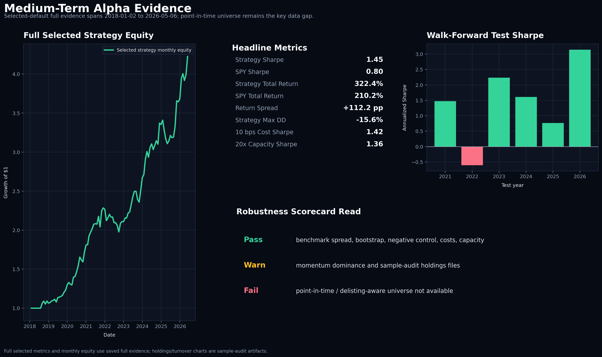

# Medium-Term Alpha Research

A Python research framework for 1-12 week cross-sectional equity strategies. The project combines interpretable signal engineering, cost-aware portfolio construction, benchmark comparison, walk-forward checks, sensitivity analysis, capacity diagnostics, and reproducible reporting.

This is historical research code, not a live execution system.



## Objective

Evaluate whether medium-term cross-sectional momentum can deliver attractive risk-adjusted returns after signal filtering, turnover controls, transaction costs, market-regime exposure scaling, and benchmark comparison.

## Universe And Horizon

- Universe: liquid large-cap US equities from the project default list, or a user-supplied price CSV.
- Benchmark: SPY.
- Holding horizon: 1-12 weeks.
- Rebalance cadence: monthly.
- Lookahead control: weights are shifted by one trading day before returns are calculated.

## Signal Construction

The selected framework uses three interpretable signal families:

- Multi-horizon momentum using 21, 63, and 126 trading-day windows.
- A 5-day recent-return skip to reduce short-term reversal contamination.
- Short-term mean-reversion penalty and quality/volatility-stability scoring.

No machine-learning model is used.

## Portfolio Construction

- Long-only selected default.
- Minimum signal-strength filter.
- Top-quantile selection.
- Inverse-volatility position scaling.
- Maximum position cap.
- Turnover gate to avoid small noisy rebalances.
- Market-regime scaling when SPY trend is negative or volatility is elevated.
- Transaction costs charged directly from turnover.

Selected default parameters are saved in `Results/selected_default_metrics.csv`.

## Transaction Costs

The default cost assumption is 5 bps per unit turnover:

```text
trading_cost = turnover * cost_per_turnover
```

Costs are included in reported net returns, benchmark comparison, sensitivity analysis, and capacity diagnostics.

## Validation Approach

The selected default is not chosen purely by maximum in-sample Sharpe. It is selected using a balanced robustness screen:

- Sharpe improvement versus the prior baseline.
- Max drawdown control.
- Turnover and total cost impact.
- SPY benchmark comparison.
- Walk-forward stability.
- Local sensitivity around nearby parameter settings.
- Bootstrap uncertainty on saved monthly returns.
- A sign-flip negative control that preserves return magnitudes while randomizing monthly return signs.
- A robustness scorecard that records pass/warn/fail checks instead of relying only on headline Sharpe.

## Auditability

The backtest now exports portfolio-level audit files whenever it runs. The committed audit CSVs are generated from `Results/sample_prices.csv`, so they demonstrate the holdings/turnover/benchmark audit trail without claiming to reproduce the full online selected-default run.

Reviewer-facing audit files:

- `Results/portfolio_weights.csv`: rebalance-date ticker weights, final signal values, volatility inputs, inverse-volatility scores, and selected flags.
- `Results/rebalance_log.csv`: selected tickers, position count, gross exposure, turnover, estimated trading cost, regime scale, and top signal per rebalance.
- `Results/daily_strategy_returns.csv`: gross return, net return, benchmark return, turnover, trading cost, and cumulative net return for the committed sample run.
- `Results/benchmark_timeseries.csv`: benchmark daily returns and cumulative benchmark return for the committed sample run.
- `Results/full_selected_default_audit_status.md`: explains why full selected-default holdings cannot be reconstructed from summary artifacts alone and gives the exact export command.

For a full online rerun, the same files are regenerated from the full downloaded dataset. The saved headline metrics below remain the selected-default evidence.

## Headline Results

Saved selected-default metrics:

| Metric | Strategy | SPY |
|---|---:|---:|
| Annualized Sharpe | 1.4505 | 0.8030 |
| Annualized Return | 18.90% | 14.57% |
| Total Return | 322.41% | 210.21% |
| Max Drawdown | -15.64% | -33.72% |
| Annualized Volatility | 12.48% | 19.26% |
| Average Turnover | 0.5999 | n/a |
| Total Trading Cost | 2.82% | n/a |

The Sharpe-improvement pass improved the selected default versus the prior baseline but did not reach the approximate 1.7 target. The selection favors a more defensible balance of Sharpe, drawdown, turnover, cost impact, and walk-forward stability.

## Robustness Report

The saved robustness report is `Results/medium_alpha_robustness_report.md`.

Current scorecard highlights:

| Check | Result |
|---|---:|
| Headline annualized Sharpe | Pass: 1.4505 |
| Sharpe spread vs SPY | Pass: +0.6475 |
| Monthly bootstrap Sharpe 95% CI lower bound | Pass: 0.8931 |
| Sign-flip negative-control p-value | Pass: 0.0000 |
| Expanding-window positive Sharpe years | Pass: 5/6 |
| Selected-candidate positive walk-forward years | Pass: 8/9 |
| Selected configuration at 10 bps costs | Pass: Sharpe 1.4236 |
| 20x cost-proxy capacity | Pass: Sharpe 1.3568 |
| Momentum dominance | Warn: 100% momentum-dominated |
| Point-in-time universe | Fail: not available |

The fail and warning rows are intentional. They are the main evidence gaps a serious reviewer should challenge.

## Reviewer-Facing Outputs

Saved CSV evidence:

- `Results/results_summary.csv`
- `Results/benchmark_comparison.csv`
- `Results/selected_default_metrics.csv`
- `Results/walk_forward_results.csv`
- `Results/sensitivity_results.csv`
- `Results/capacity_simulation.csv`
- `Results/factor_behavior_summary.csv`
- `Results/monthly_results.csv`
- `Results/medium_alpha_bootstrap_ci.csv`
- `Results/medium_alpha_negative_controls.csv`
- `Results/medium_alpha_robustness_scorecard.csv`
- `Results/medium_alpha_robustness_report.md`
- `Results/portfolio_weights.csv`
- `Results/rebalance_log.csv`
- `Results/daily_strategy_returns.csv`
- `Results/benchmark_timeseries.csv`
- `Results/full_selected_default_audit_status.md`

Generated plots:

- `Plots/medium_term_alpha_report.png`
- `Plots/cumulative_returns.png`
- `Plots/drawdown.png`
- `Plots/rolling_sharpe.png`
- `Plots/annual_returns.png`
- `Plots/walk_forward_yearly_performance.png`
- `Plots/cost_capacity_sensitivity.png`
- `Plots/bootstrap_negative_control.png`
- `Plots/turnover_holdings_concentration.png`
- `Plots/factor_diagnostics.png`

Dark reviewer plots are regenerated from the saved CSVs using `python3 scripts/generate_research_plots.py` from the repository root.
`cumulative_returns.png` uses the full saved monthly strategy equity and benchmark summary bars; `drawdown.png` uses the full monthly strategy drawdown path plus saved strategy/SPY max drawdown bars. Holdings and turnover plots remain sample-audit views until a pinned full holdings panel is supplied.

## Run The Project

Install dependencies:

```powershell
pip install -r requirements.txt
```

Run the included fixed sample:

```powershell
python main.py --csv Results\sample_prices.csv --output-dir Results_sample --plots-dir Plots_sample
```

Run the default online data workflow:

```powershell
python main.py --start 2018-01-01
```

Export full selected-default holdings from a pinned full price panel:

```bash
python3 ../scripts/export_medium_alpha_selected_audit.py --csv /path/to/pinned_full_prices.csv --benchmark-csv /path/to/pinned_benchmark_prices.csv --output-dir Results_full_selected_default --plots-dir Plots_full_selected_default
```

Regenerate plots from saved CSVs:

```powershell
python ../scripts/generate_research_plots.py
```

Regenerate the robustness report:

```powershell
python ..\scripts\analyze_medium_alpha_evidence.py --results-dir Results
```

Update the root README from a run only when explicitly requested:

```powershell
python main.py --start 2018-01-01 --update-root-readme
```

Run the bounded Sharpe-improvement research grid:

```powershell
python main.py --start 2018-01-01 --run-sharpe-research
```

Online runs depend on data availability from the configured data source. The committed sample CSV is used for reproducibility checks.

## Limitations

- The default universe is not point-in-time and may contain survivorship bias.
- The strategy is momentum-dominated in the saved factor diagnostics.
- Online data quality depends on the data provider and ticker availability.
- The committed audit CSVs are from the fixed sample run; full selected-default holdings require a pinned full price panel and the export wrapper in `scripts/export_medium_alpha_selected_audit.py`.
- Capacity analysis is a cost-stress proxy, not a calibrated market-impact model.
- The sign-flip negative control is useful but does not replace signal-shuffle tests on raw price data.
- The strategy is not a live execution system and does not include broker-specific implementation details.
- Historical results are not guaranteed to persist.

## Next Improvements

- Use a point-in-time, delisting-aware equity universe.
- Run `scripts/export_medium_alpha_selected_audit.py` on a pinned market-data snapshot and retain the resulting manifest plus holdings audit.
- Calibrate costs and impact assumptions from execution data.
- Repeat validation on additional universes without tuning per ticker or per year.
